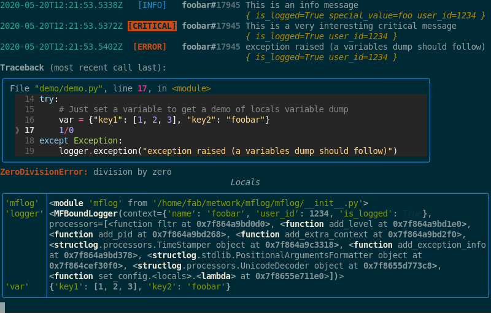

# mflog

[//]: # (automatically generated from https://github.com/metwork-framework/github_organization_management/blob/master/common_files/README.md)

**Status (master branch)**


[](https://github.com/metwork-framework/mflog/actions?query=workflow%3ACI&branch=master)
[]()


## What is it ?

It is an opinionated python (structured) logging library built on [structlog](https://www.structlog.org/)
for the [MetWork Framework](http://metwork-framework.org) (but it can be used in any context).

> Structured logging means that you don’t write hard-to-parse and hard-to-keep-consistent prose in your logs but that you log events that happen in a context instead.
> - https://www.structlog.org/en/stable/why.html

Example:

```python

from mflog import get_logger

# Get a logger
log = get_logger("foo.bar")

# Bind some attributes to the logger depending on the context
log = log.bind(user="john")
log = log.bind(user_id=123)

# [...]

# Log something
log.warning("user logged in", happy=True, another_key=42)
```

On `stderr`, you will get:

```
2019-01-28T07:52:42.903067Z  [WARNING] (foo.bar#7343) user logged in {another_key=42 happy=True user=john user_id=123}
```

On `json output file`, you will get:

```json
{
    "timestamp": "2019-01-28T08:16:40.047710Z",
    "level": "warning",
    "name": "foo.bar",
    "pid": 29317,
    "event": "user logged in",
    "another_key": 42,
    "happy": true,
    "user": "john",
    "user_id": 123
}
```

If the [python/rich library](https://github.com/willmcgugan/rich) is installed (this is not a
mandatory requirement) and if the output is a real terminal (and not a redirection or a pipe),
the library will automatically configure a fancy color output (of course you can disable it if
you don't like):

With following demo python program:
```python
import mflog

# Get a logger
logger = mflog.get_logger("foobar")

# Bind two context variables to this logger
logger = logger.bind(user_id=1234, is_logged=True)

# Log something
logger.info("This is an info message", special_value="foo")
logger.critical("This is a very interesting critical message")

# Let's play with exception
try:
    # Just set a variable to get a demo of locals variable dump
    var = {"key1": [1, 2, 3], "key2": "foobar"}
    1/0
except Exception:
    logger.exception("exception raised (a variables dump should follow)")

```

You will get this color ouput:



## (opinionated) Choices and Features

- we use main ideas from `structlog` library
- we log `[DEBUG]` and `[INFO]` messages on `stdout` (in a human friendly way)
- we log `[WARNING]`, `[ERROR]` and `[CRITICAL]` on `stderr` (in a human friendly way)
- (and optionally) we log all messages (worse than a minimal configurable level) in a configurable file in `JSON` (for easy automatic parsing)
- (and optionally) we send all messages (worse than a minimal configurable level) to an UDP syslog server (in JSON or in plain text)
- we can configure a global minimal level to ignore all messages below
- we reconfigure automatically python standard logging library to use `mflog`
- Unicode and Bytes messages are supported (in Python2 and Python3)
- good support for exceptions (with backtraces)
- override easily minimal levels (for patterns of logger names) programmatically or with plain text configuration files
- if the [python/rich library](https://github.com/willmcgugan/rich) is installed (this is not a mandatory requirement) and if the output is a real terminal (and not a redirection), the library will automatically configure a fancy color output (can be really useful but of course you can disable this feature if you don't like it)

## How to use ?

A `mflog` logger can be used as a standard `logging` logger.

For example:

```python
# Import
from mflog import get_logger

# Get a logger
x = get_logger("foo.bar")

# Usage
x.warning("basic message")
x.critical("message with templates: %i, %s", 2, "foo")
x.debug("message with key/values", foo=True, bar="string")

try:
    1/0
except Exception:
    x.exception("we catched an exception with automatic traceback")

x = x.bind(context1="foo")
x = x.bind(context2="bar")
x.info("this is a contexted message", extra_var=123)
```

## How to configure ?

### In python

```python
import mflog

# Configure
mflog.set_config(minimal_level="DEBUG", json_minimal_level="WARNING",
                 json_file="/foo/bar/my_output.json")

# Get a logger
x = mflog.get_logger("foo.bar")

# [...]
```

### With environment variables

```bash

$ export MFLOG_MINIMAL_LEVEL="DEBUG"
$ export MFLOG_JSON_MINIMAL_LEVEL="WARNING"
$ export MFLOG_JSON_FILE="/foo/bar/my_output.json"

$ python

>>> import mflog
>>>
>>> # Get a logger
>>> x = mflog.get_logger("foo.bar")
>>>
>>> # [...]
```

### Note

When you get a `mflog` logger, if default configuration is applied automatically
if not set manually before.

## How to override minimal level for a specific logger

If you have a "noisy" specific logger, you can override its minimal log level.

The idea is to configure this in a file like this:

```
# lines beginning with # are comments

# this line say 'foo.bar' logger will have a minimal level of WARNING
foo.bar => WARNING

# this line say 'foo.*' loggers will have a minimal level of DEBUG
# (see python fnmatch for accepted wildcards)
foo.* => DEBUG

# The first match wins
```

Then, you can use

```python

# yes we use a list here because you can use several files
# (the first match wins)
mflog.set_config([...], override_files=["/full/path/to/your/override.conf"])
```

or

```
# if you want to provide multiple files, use ';' as a separator
export MFLOG_MINIMAL_LEVEL_OVERRIDE_FILES=/full/path/to/your/override.conf
```

## Link with standard python logging library

When you get a `mflog` logger or when you call `set_config()` function,
the standard python `logging` library is reconfigured to use `mflog`.

Example:

```python
import logging
import mflog

# standard use of logging library
x = logging.getLogger("standard.logger")
print("<output of the standard logging library>")
x.warning("foo bar")
print("</output of the standard logging library>")

# we set the mflog configuration
mflog.set_config()

# now logging library use mflog
print()
print("<output of the standard logging library through mflog>")
x.warning("foo bar")
print("</output of the standard logging library through mflog>")
```

Output:

```
<output of the standard logging library>
foo bar
</output of the standard logging library>

<output of the standard logging library through mflog>
2019-01-29T09:32:37.093240Z  [WARNING] (standard.logger#15809) foo bar
</output of the standard logging library through mflog>
```

## mflog loggers API

### `.debug(message, *args, **kwargs)`

Log the given message as `[DEBUG]`.

- `*args` can be used for placeholders (to format the given message)
- `**kwargs` can be used for key/values (log context).

Examples:

```python
from mflog import get_logger

x = get_logger('my.logger')
x.debug("my debug message with placeholders: %s and %i", "foo", 123,
        key1="value1, key2=True, key5=123)
```

### `.info(message, *args, **kwargs)`

Same as `.debug` but with `[INFO]` severity level.

### `.warning(message, *args, **kwargs)`

Same as `.debug` but with `[WARNING]` severity level.

### `.error(message, *args, **kwargs)`

Same as `.debug` but with `[ERROR]` severity level.

### `.critical(message, *args, **kwargs)`

Same as `.debug` but with `[CRITICAL]` severity level.

### `.exception(message, *args, **kwargs)`

Same as `.error` (so with `[ERROR]` severity level) but we automatically add
the current stacktrace in the message through special key/values.

### `.bind(**new_values)`

Return a new logger with `**new_values` added to the existing ones
(see examples at the beginning).

### `.unbind(*keys)`

Return a new logger with `*keys` removed from the context.
It raises `KeyError` if the key is not part of the context.

### `.try_unbind(*keys)`

Like `.unbind` but best effort:  missing keys are ignored.

### `.die(optional_message, *args, **kwargs)`

Same as `.exception()` but also do a `.dump_locals()` call and exit the program
with `sys.exit(1)`.

### `.dump_locals()`

Dump locals variables on `stderr` (for debugging).

### `mflog.*`

All previous loggers method are also available in `mflog` module.

Example:

```python

import mflog

mflog.warning("this is a warning message", context1="foobar", user_id=123)
```

## FAQ

## If I want to use mflog inside my library ?

If you write a library and if you want to use `mflog`, use `mflog` normally.
You just should avoid to call `set_config()` inside your library.


## Do you have "thread local context mode" ?

This mode is explained [here](https://www.structlog.org/en/stable/thread-local.html).

You have to understand what you are doing.

If you want to use it, just add `thread_local_context=True` to your `set_config()`
call. And you can use `.new(**new_values)` on mflog loggers to clear context
and binds some initial values.


## Can I globally add an extra context to each log line ?

If you add `extra_context_func=your_python_func` to your `set_config()` call,
and if `your_python_func` returns a dict of key/values as strings when called
with no argument, these key/values will be added to your log context.

Another way to do that without even calling `set_config()` is to define
an environment variable called `MFLOG_EXTRA_CONTEXT_FUNC` containing the
full path to your python func.

Full example:

```bash
# in shell
export MFLOG_EXTRA_CONTEXT_FUNC="mflog.unittests.extra_context"
```

then, in your python interpreter:

```python
>>> from mflog import get_logger
>>> get_logger("foo").info("bar")
2019-04-11T07:32:53.517260Z     [INFO] (foo#15379) bar {extra_context_key1=extra_context_value1 extra_context_key2=extra_context_value2}
```

Here is the code of `mflog.unittests.extra_context`:

```python
def extra_context():
    return {"extra_context_key1": "extra_context_value1",
            "extra_context_key2": "extra_context_value2"}
```

## Can I filter some context keys in stdout/stderr output (but keep them in json output) ?

Yes, add `json_only_keys=["key1", "key2"]` to your `set_config()` call or use
`MFLOG_JSON_ONLY_KEYS=key1,key2` environment variable.

## What about if I don't want to redirect standard python `logging` to `mflog` ?

You can add `standard_logging_redirect=False` in your `set_config()` call
of set `MFLOG_STANDARD_LOGGING_REDIRECT=0` environment variable.

## Can I silent a specific noisy logger?

You can use `override_files` feature to do that or you can also use the
`mflog.add_override` function.

For example:

```python
import mflog

# for all mylogger.* loggers (fnmatch pattern), the minimal level is CRITICAL
mflog.add_override("mylogger.*", CRITICAL)

# Not very interesting but this call will be ignored
mflog.get_logger("mylogger.foo").warning("foo")
```

## How can I use syslog logging?

You can configure it with these keyword arguments during `set_config()` call:

- `syslog_minimal_level`: `WARNING`, `CRITICAL`...
- `syslog_address`: `null` (no syslog (defaut)), `127.0.0.1:514` (send packets to 127.0.0.1:514), `/dev/log` (unix socket)...
- `syslog_format`: `msg_only` (default) or `json`

or with corresponding env vars:

- `MFLOG_SYSLOG_MINIMAL_LEVEL`
- `MFLOG_SYSLOG_ADDRESS`
- `MFLOG_SYSLOG_FORMAT`

## How to disable the fancy color output?

This feature is automatically enabled when:

- [python/rich](https://github.com/willmcgugan/rich) library is installed
- the corresponding output (stdout, stderr) is a real terminal (and not a redirection to a file)

But you can manually disable it by adding `fancy_output=False` to your `set_config()`.

## Coverage

See [Coverage report](https://metwork-framework.org/pub/misc/mflog/coverage/)


## Contributing guide

See [CONTRIBUTING.md](CONTRIBUTING.md) file.


## Code of Conduct

See [CODE_OF_CONDUCT.md](CODE_OF_CONDUCT.md) file.


## Sponsors

*(If you are officially paid to work on MetWork Framework, please contact us to add your company logo here!)*

[](http://www.meteofrance.com)
